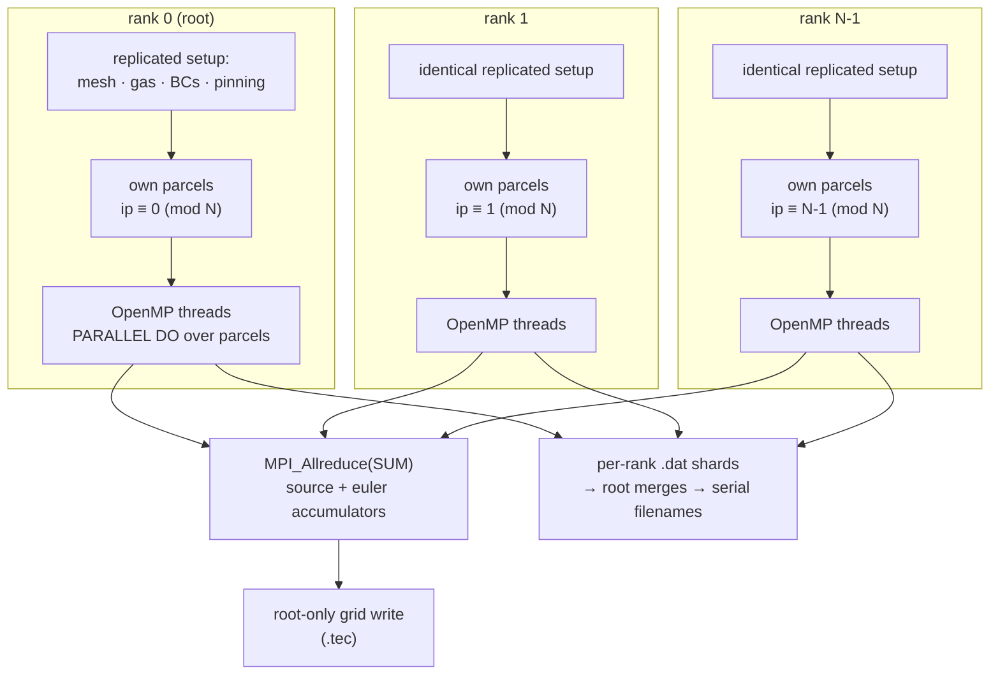

# Parallelization — MPI + OpenMP

IGLOO is parallel on **one axis only: particles**. MPI distributes parcels across ranks,
OpenMP distributes a rank's parcels across threads. The mesh and the gas field are
**read-only and fully replicated on every rank** — there is no domain decomposition, no
halo exchange, and no particle↔particle communication anywhere in the solve.

That is a deliberate design choice, and it is what makes the output **rank-count
invariant by construction** rather than by luck.



## Why particles are safe to split

`integrate` is **write-only** with respect to the grid accumulators — `srcblock` and
`eulblock` appear only as arguments — so a parcel's trajectory never depends on another
parcel's deposition. The only shared writes in the entire tree are **11 `!$OMP ATOMIC`
grid accumulations** in `src/lib/Lib_Integration.f90` (5 for the
source field in `computeSrcField`, 6 for the euler field in `computeEulField`).

Consequence: any partition of the parcel set produces the same trajectories. Only the
*grid* accumulators need combining, and summation is associative up to floating-point
re-association — which is why the grid `.tec` is compared with a tolerance while the
particle `.dat` is compared as an exact multiset.

## Level 1 — MPI, across ranks

### Ownership

One predicate, in `src/lib/IGLOO_Mod_MPI.f90`:

```fortran
owns_particle(ip) = (mod(ip - 1, mpi_size_) == mpi_rank_)
```

**Striped, not blocked**, and indexed **within a group**. Both choices are deliberate:
groups differ wildly in parcel count and per-parcel cost, and pinning sweeps faces
spatially, so striding decorrelates spatially-correlated cost. It is `pure`, so it can sit
in a loop condition without inhibiting optimisation.

!!! warning "Drive the loop bound from `gr%nInjected`, never `gr%nparticles`"
    `solve` overwrites `nparticles` with `nactive` once children exist. Using it would make
    ownership rank-dependent — and therefore make results depend on the rank count.

### The three choke points

The whole MPI surface is three places. Everything else is serial-identical code.

| # | Where | What it does |
|---|---|---|
| 1 | `owns_particle` in `solve`'s two `!$OMP PARALLEL DO` loops | each rank integrates only its stripe |
| 2 | `reduce_accumulators` at the end of `solve` | `MPI_Allreduce(SUM)` over the source and euler accumulators |
| 3 | `merge_rank_particle_files` in `writeout` | root collapses per-rank `.dat` shards into the serial file layout |

`src/` carries only **11 `USE_MPI` guards** in total — 9 inside the MPI module itself, one
in `obj_IGLOO.f90`, one in the driver. A serial build compiles the module to no-ops
(`mpi_size_ = 1`, `mpi_is_root = .true.`, `rank_suffix()` empty), so **the serial code path
is byte-identical to what it was before MPI existed**.

### Rank-invariance is the hard part

Splitting the work is easy; getting *identical numbers* out of any rank count is not. Three
mechanisms carry it:

**1 — Per-parcel RNG streams.** Every parcel's stream is seeded from `(rng_seed, famID, ID)`.
Before this, TAB's child-size sampler drew `random_number` *inside* the OpenMP region, so
even identically-seeded ranks diverged with thread scheduling. Replication alone was **not**
sufficient.

**2 — Globally-banded parcel IDs.** Parcel IDs must be rank-*invariant*, not merely unique,
because `part%ID` seeds scatter emission (`wAcc = dNscat·mod(ID·φ, 1)`). A storage index
would change with the partition and silently move the scatter cloud.

**3 — The global child-ID census.** Parcels form generations: gen 0 is the pinned parents
(`1..nInjected`), gen *L* the pass-*L* children, each generation owning a contiguous global
band. One `MPI_Allreduce(SUM)` per breakup pass, over a vector indexed by position in the
current band, reconstructs the exact serial per-parent child-count vector. From it each rank
derives a rank-uniform termination test and an exclusive prefix sum placing each parent's
children in the band.

This is legal because **every parcel is written by exactly one rank**: on pass 1 a non-owned
parent is cycled and keeps the `n = 0` every rank stores unconditionally; on passes ≥2 the
window holds only locally-created children. Serial equivalence is exact by induction and is
asserted permanently by an `mpi_size_ == 1` tripwire.

!!! note "The `dNscat` pre-pass stays fully replicated"
    Do **not** add an ownership guard there. It computes the scatter quantum; striping it
    would give each rank a different quantum and desynchronise the cloud.

### Output model

Ranks write **shards**, root merges them:

```
trajectories-A-sweep1.rank2.dat        ← per-rank shard
        └── kind ── material ── sweep tag ── rank marker
```

`rank_suffix()` composes **after** the sweep tag, so `<kind>-<material><sweeptag>` stays the
logical file identity and `.rank<r>` is a pure shard marker — the merge globs
`<logical>.rank*.dat` per sweep. Reversing the order would make the glob straddle sweeps.

The merge is a **lockstep zone merge, not a concatenation**. Every rank writes the same
`variables=` line and the same zone headers in the same order (the material and group loops
are fully replicated; only the particles inside them are striped), so emitting each header
once and interleaving the data blocks reproduces the serial layout exactly — every existing
`check.py` runs unmodified. Structural disagreement between shards is **fatal**, never
patched over: a differing header or zone count means the replication assumption is false, and
concatenating anyway would produce a file that loads in Tecplot and is wrong.

Within a zone, records come out rank-blocked. That is deliberately **not** sorted — the
serial file is not sorted either (OpenMP already interleaves), and every gate treats record
order as noise. Each parcel is owned by one rank, so its own records stay contiguous and in
time order, which is what the per-ID loaders in the oracles actually rely on.

At one rank the suffix is empty and the merge is a no-op, so **a serial run keeps
byte-identical filenames**. Nothing downstream needs to know the rank count.

Grid output (`.tec`) is **root-only**, after the allreduce.

## Level 2 — OpenMP, within a rank

Two `!$OMP PARALLEL DO SCHEDULE(DYNAMIC)` loops in
`src/lib/obj_IGLOO.f90::solve` — one for the breakup path, one for the
no-breakup path. `DYNAMIC` because per-parcel cost varies by orders of magnitude (a parcel
that breaks up 200 times against one that exits immediately).

Ownership composes with threading trivially: the stripe filter is a `cycle` at the top of the
loop body, so MPI and OpenMP are genuinely orthogonal axes.

`setupRHS` writes module-level per-material state, so **materials must be set up and
integrated sequentially** — the parallelism is over particles *within* a group. There is a
runtime tripwire: `error stop` if `setupRHS` is ever called inside a parallel region.

## Embedding contract

For a parent solver driving IGLOO:

- **The parent owns `MPI_Init` / `MPI_Finalize`.** The library never finalizes MPI.
- **`external_gas` must be passed identically on every rank** — replication is assumed, not
  checked.
- The hook is `setup_static(external_gas)` **once**, then
  `reset_state(gas)` → `solve` → `writeout` **per sweep**. `solve` hard-errors via
  `stateIsFresh` if `reset_state` did not run.

Recommended placement: `mpirun --map-by numa --bind-to numa`, `OMP_PLACES=cores`,
`OMP_PROC_BIND=close`, `KMP_STACKSIZE=100M`, `ulimit -s unlimited`.

## Measured performance

!!! danger "Check `uptime` before believing any timing here"
    These hosts are shared. Steady contention once faked a 2× error *invisibly* — it shifts
    the mean without widening the spread, so tightly-clustered repeats look trustworthy and
    are not. Always time both arms adjacently, in one batch, on one host, from local `/tmp`
    (`/data10` is an NFS export).

`khrt-stress` (1.64 M scatter records), **single rank**, so this is pure OpenMP scaling —
measured on sprop1, load 41–42, median of 3, before/after the scatter-buffering fix
(`fa1a9b2`):

| threads | before | after |
|---|---|---|
| 1 | 13645 ms | 13818 ms (+1.3 %) |
| 2 | 17366 ms — **0.79×** | 8385 ms — **1.65×** |
| 5 | 19121 ms — **0.71×** | 5591 ms — **2.47×** |

Hybrid grid, 4 slots, same host:

| configuration | before | after |
|---|---|---|
| 4 ranks × 1 thread | 7537 ms | 7223 ms |
| 2 ranks × 2 threads | 11707 ms | 7451 ms |
| 1 rank × 4 threads | 19176 ms | **5652 ms** |

Threads went from a **2.54× penalty to a 1.28× benefit**, and `1 rank × 4 threads` is now the
fastest of the three. **That is what makes hybrid MPI+OpenMP worth configuring at all** — before
`fa1a9b2`, adding threads actively hurt, so the only sane configuration was rank-only.

The `+1.3 %` at one thread is the buffering overhead with no lock contention to remove: the
honest cost of the fix.

### What was fixed, and what is left

`fa1a9b2` buffers each parcel's scatter records inside `integrate` and emits them with **one
write** when the parcel finishes, instead of one write per record. On `khrt-stress` that is
~2270 records per parcel, so lock acquisitions drop ~2000× (1.65 M → 726) and the formatting
moves *inside* the parallel region where it scales. Memory is bounded by one parcel's records
(~270 kB), not the 195 MB total. Values are bit-for-bit unchanged.

**Per-thread shard files were measured and rejected** — net worse. The remaining thread-scaling
limit is in the **compute** path (OSlo implicit solver 37–38 %, `pow` 32 %, memory bandwidth),
not in output.

Levers that do work, in order of cost:

1. **Zero code: put `OUTPUT/` on tmpfs** — worth 1.7 s here, 14 % at one thread, **30 % at five**.
2. Fewer bytes: binary scatter records, or a sampling stride on the cloud.
3. MPI-IO at computed offsets, so ranks write one file with no merge at all.

## How this is verified

Rank-count invariance is **gated**, not assumed. Five MPI cases run under `mpiexec`
(`tests/mpi/`), registered only in a `USE_MPI` build:

| gate | ranks × threads |
|---|---|
| `mpi-drag-stokes` | 2 × 2 |
| `mpi-conv-nu` | 4 × 2 |
| `mpi-khrt` | 4 × 2 |
| `mpi-bc-center-2grp` | 4 × 2 |
| `mpi-consistency` | cross-rank-count comparison |

Each case symlinks its parent case's `INPUT/`, `input.ini` and `check.py`, so the fixture and
the oracle are shared with the serial gate — the MPI case adds only the launch and the
witness.

!!! warning "The rank witness is load-bearing"
    Every MPI case greps the solver log for `MPI ranks = <n>`. **Without it a serial binary
    launched under `mpiexec -n 4` passes every oracle while decomposing nothing** — four
    independent full sweeps clobbering each other's output still satisfy a per-particle
    trajectory check.

Measured invariance: `.dat` sorted multisets identical at n = 1, 2, 3, 4, 5, 7; grid `.tec`
bit-identical at n = 1, 2, 4 on most cases (worst 1.8e-23 of field scale on `vie-plait`, from
`!$OMP ATOMIC` re-association). Shard count scales as 3n while the merged record total stays
invariant — **that is what proves partitioning rather than replication**. Balance at n = 7:
33–47 exit records per rank.

Falsifiability was checked: reverting `kid%ID` to the storage index turns `mpi-khrt` RED at
n ≥ 2, and the scatter record count itself moves (566572 → 566580).

## Build

```bash
# hybrid MPI + OpenMP
./install.sh build --master=None --compilers=intel --use-openmp --use-mpi
mpirun -n 4 ./bin/IGLOO
```

!!! danger "`--use-mpi` and `--use-tecio` cannot be combined"
    ORION builds `teciompi` under MPI but links `tecio::tecio`, so the configure fails. ASCII
    `.tec` I/O works fine without TecIO, which is what the whole test suite uses.

!!! danger "`bin/IGLOO` is ONE link target shared by every build tree"
    `cmake --build <tree>` is a **no-op** when that tree has nothing to recompile, so it can
    leave the *other* tree's binary in place and the gates will run that instead — green, and
    meaningless. After any cross-tree build:

    ```bash
    rm -f bin/IGLOO && cmake --build build/verif -j 8
    ldd bin/IGLOO | grep -c libmpi        # 0 = serial, >0 = MPI
    ```

## Known limits

- **`nm > 1` is untested suite-wide** — no case has more than one material.
- **Setup is replicated, including the Tecplot read**: N ranks read the same file. Accepted
  one-time cost at this scale; a rank-0 read + broadcast is the obvious V2.
- **Memory does not scale**: every rank holds the full mesh, gas field and accumulators
  (`O(nb × nfam × cells)` per rank). Breaking that wall needs shared-memory windows
  (`MPI_Win_allocate_shared`) or genuine domain decomposition — neither is implemented.
- The parallelization is **one-way**: the gas field is steady and read-only within a sweep.
  Two-way coupling would need the accumulators fed back, which changes the communication
  pattern entirely.
