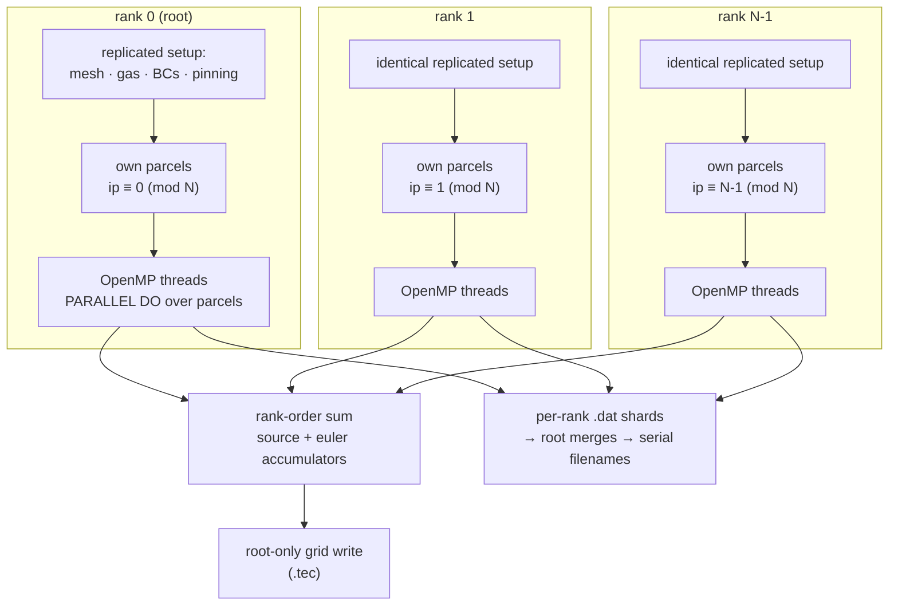

# Parallelization — MPI + OpenMP

IGLOO is parallel on **one axis only: particles**. MPI distributes parcels across ranks,
OpenMP distributes a rank's parcels across threads. The mesh and the gas field are
**read-only and fully replicated on every rank** — there is no domain decomposition, no
halo exchange, and no particle↔particle communication anywhere in the solve.

That is a deliberate design choice, and it is what makes the output **rank-count
invariant by construction** rather than by luck.


```mermaid
flowchart TB
    subgraph R0["rank 0 (root)"]
        S0["replicated setup:<br/>mesh · gas · BCs · pinning"] --> P0["own parcels<br/>ip ≡ 0 (mod N)"]
        P0 --> T0["OpenMP threads<br/>PARALLEL DO over parcels"]
    end
    subgraph R1["rank 1"]
        S1["identical replicated setup"] --> P1["own parcels<br/>ip ≡ 1 (mod N)"]
        P1 --> T1["OpenMP threads"]
    end
    subgraph RN["rank N-1"]
        SN["identical replicated setup"] --> PN["own parcels<br/>ip ≡ N-1 (mod N)"]
        PN --> TN["OpenMP threads"]
    end
    T0 --> A["rank-order sum<br/>source + euler accumulators"]
    T1 --> A
    TN --> A
    A --> W["root-only grid write<br/>(.tec)"]
    T0 --> M["per-rank .dat shards<br/>→ root merges → serial filenames"]
    T1 --> M
    TN --> M
```

## Why particles are safe to split

`integrate` is **write-only** with respect to the grid accumulators — `srcblock` and
`eulblock` appear only as arguments — so a parcel's trajectory never depends on another
parcel's deposition. The only shared writes in the entire tree are **15 `!$OMP ATOMIC` updates** in
`src/lib/Lib_Integration.f90`: 11 grid accumulations (5 for the source field in
`computeSrcField`, 6 for the euler field in `computeEulField`) and 4 wedge-fold counters.

Consequence: any partition of the parcel set produces the same trajectories. Only the
*grid* accumulators need combining, and summation is associative up to floating-point
re-association — which is why the grid `.tec` is compared with a tolerance while the
particle `.dat` is compared as an exact multiset.

### The cross-rank sum is fixed in rank order

The ranks' partial accumulators are added in rank order, `((v0 + v1) + v2) + …`: rank r
receives the sum of ranks 0..r−1, adds its own part and passes it on, and the last rank's
total is broadcast (`mpi_ordered_sum_r8_array`). A library reduction (`MPI_Allreduce`) would
let the MPI library choose the association per message size and rank count — on Intel MPI
the ring algorithm (`I_MPI_ADJUST_ALLREDUCE=8`) and the default give different bytes on the
1672-parcel vortex cloud at three and four ranks. With the fixed order the grid fields at a
given rank count are the same bytes on every run, placement and library tuning, at one
thread per rank (inside a rank, the `!$OMP ATOMIC` deposits of several threads still land in
scheduling order). The cost per accumulator array is p − 1 point-to-point messages per 8 MiB
chunk plus one broadcast; the integer census and fold counters keep `MPI_Allreduce`
(integer sums are exact in any order).

## Level 1 — MPI, across ranks

### Ownership

One predicate, in `src/lib/IGLOO_Mod_MPI.f90`:

```fortran
owns_particle(ip) = (mod(ip - 1, mpi_size_) == mpi_rank_)
```

**Striped, not blocked**, and indexed **within a group**. Both choices are deliberate:
groups differ wildly in parcel count and per-parcel cost, and pinning sweeps faces
spatially, so striding decorrelates spatially-correlated cost. It is `pure`, so it can sit
in a loop condition without inhibiting optimisation.

!!! warning "Drive the loop bound from `gr%nInjected`, never `gr%nparticles`"
    `solve` overwrites `nparticles` with `nactive` once children exist. Using it would make
    ownership rank-dependent — and therefore make results depend on the rank count.

### The three choke points

The whole MPI surface is three places. Everything else is serial-identical code.

| # | Where | What it does |
|---|---|---|
| 1 | `owns_particle` in `solve`'s two `!$OMP PARALLEL DO` loops | each rank integrates only its stripe |
| 2 | `reduce_accumulators` at the end of `solve` | sum of the source and euler accumulators over the ranks, in rank order |
| 3 | `merge_rank_particle_files` in `writeout` | root collapses per-rank `.dat` shards into the serial file layout |

Every `#ifdef USE_MPI` in `src/` lives inside `IGLOO_Mod_MPI.f90`, apart from the timing
report's one gather in `IGLOO_Mod_Timing.f90` (a leaf module, so that any routine can mark a
phase); the rest of the tree calls their wrappers (`mpi_init_env`, `owns_particle`,
`reduce_accumulators`, …). A serial
build compiles the module to no-ops (`mpi_size_ = 1`, `mpi_is_root = .true.`,
`rank_suffix()` empty), so **the serial code path carries no MPI logic at all**.

### Rank-invariance is the hard part

Splitting the work is easy; getting *identical numbers* out of any rank count is not. Three
mechanisms carry it:

**1 — Per-parcel RNG streams.** Every parcel's stream is seeded from `(rng_seed, famID, ID)`,
so a stochastic draw (TAB child sizes, ETAB kick azimuths) depends only on the parcel, never
on which thread or rank happens to integrate it. A shared `random_number` stream inside the
parallel region would diverge with thread scheduling even on identically-seeded ranks.

**2 — Globally-banded parcel IDs.** Parcel IDs must be rank-*invariant*, not merely unique,
because `part%ID` seeds scatter emission (`wAcc = dNscat·mod(ID·φ, 1)`). A storage index
would change with the partition and silently move the scatter cloud.

**3 — The global child-ID census.** Parcels form generations: gen 0 is the pinned parents
(`1..nInjected`), gen *L* the pass-*L* children, each generation owning a contiguous global
band. One `MPI_Allreduce(SUM)` per breakup pass, over a vector indexed by position in the
current band, reconstructs the exact serial per-parent child-count vector. From it each rank
derives a rank-uniform termination test and an exclusive prefix sum placing each parent's
children in the band.

This is legal because **every parcel is written by exactly one rank**: on pass 1 a non-owned
parent is cycled and keeps the `n = 0` every rank stores unconditionally; on passes ≥2 the
window holds only locally-created children. Serial equivalence is exact by induction and is
asserted permanently by an `mpi_size_ == 1` tripwire.

!!! note "The `dNscat` pre-pass stays fully replicated"
    Do **not** add an ownership guard there. It computes the scatter quantum; striping it
    would give each rank a different quantum and desynchronise the cloud.

### Output model

Ranks write **shards**, root merges them:

```
trajectories-A-sweep1.rank2.dat        ← per-rank shard
        └── kind ── material ── sweep tag ── rank marker
```

`rank_suffix()` composes **after** the sweep tag, so `<kind>-<material><sweeptag>` stays the
logical file identity and `.rank<r>` is a pure shard marker — the merge globs
`<logical>.rank*.dat` per sweep. Reversing the order would make the glob straddle sweeps.

The merge is a **lockstep zone merge, not a concatenation**. Every rank writes the same
`variables=` line and the same zone headers in the same order (the material and group loops
are fully replicated; only the particles inside them are striped), so emitting each header
once and interleaving the data blocks reproduces the serial layout exactly — every existing
`check.py` runs unmodified. Structural disagreement between shards is **fatal**, never
patched over: a differing header or zone count means the replication assumption is false, and
concatenating anyway would produce a file that loads in Tecplot and is wrong.

Within a zone, records come out rank-blocked. That is deliberately **not** sorted — the
serial file is not sorted either (OpenMP already interleaves), and every gate treats record
order as noise. Each parcel is owned by one rank, so its own records stay contiguous and in
time order, which is what the per-ID loaders in the oracles actually rely on.

At one rank the suffix is empty and the merge is a no-op, so **a serial run keeps
byte-identical filenames**. Nothing downstream needs to know the rank count.

Grid output (`.tec`) is **root-only**, after the cross-rank sum.

## Level 2 — OpenMP, within a rank

Two `!$OMP PARALLEL DO SCHEDULE(DYNAMIC)` loops in
`src/lib/obj_IGLOO.f90::solve` — one for the breakup path, one for the
no-breakup path. `DYNAMIC` because per-parcel cost varies by orders of magnitude (a parcel
that breaks up 200 times against one that exits immediately).

Ownership composes with threading trivially: the stripe filter is a `cycle` at the top of the
loop body, so MPI and OpenMP are genuinely orthogonal axes.

`setupRHS` writes module-level per-material state, so **materials must be set up and
integrated sequentially** — the parallelism is over particles *within* a group. There is a
runtime tripwire: `error stop` if `setupRHS` is ever called inside a parallel region.

### Fatal errors inside the parcel loop

MPI is initialised at `MPI_THREAD_FUNNELED`: every MPI call is made by the master thread
outside the parallel regions, so a worker thread may neither call `MPI_Abort` nor stop its rank
while the others wait in the next collective. Under MPI the fatal sites reachable inside the
parcel loop — a non-finite step size after the update (`integrate`), an unknown BC code at
injection (`initializePart`), a wedge fold that leaves the sector (`axisymFold`) — record the
first message (`region_fail`) and drop their parcel; `integrate` returns at entry once a failure
is recorded and ends the parcels in flight at their next segment; when the loop has joined, the
master thread calls `region_fail_check`, which prints `[IGLOO rank r] ABORT: <message>` and
aborts every rank. A serial run stops at the site as before, with the same message and exit
code. Two guards stay `error stop` under MPI: the gas `cp <= 0` check of the evaporation models
(a `pure` procedure) and the parameter checks of the breakup size samplers (inside a rejection
loop); Intel MPI's launcher then ends the whole job on the rank's non-zero exit.

## Embedding contract

For a parent solver driving IGLOO:

- **The parent owns `MPI_Init` / `MPI_Finalize`.** The library never finalizes MPI.
- **`external_gas` must be passed identically on every rank** — replication is assumed, not
  checked.
- The hook is `setup_static(external_gas)` **once**, then
  `reset_state(gas)` → `solve` → `writeout` **per sweep**. `solve` hard-errors via
  `stateIsFresh` if `reset_state` did not run.

Recommended placement: `mpirun --map-by numa --bind-to numa`, `OMP_PLACES=cores`,
`OMP_PROC_BIND=close`, `KMP_STACKSIZE=100M`, `ulimit -s unlimited`.

## Scatter-cloud output path

Scatter records are the one output stream large enough to matter for scaling
(`khrt-stress` emits 1.64 M of them). Each parcel buffers its own records inside
`integrate` and emits them with **one write** when it finishes, instead of one write per
record: on `khrt-stress` that is ~2270 records per parcel, so the number of lock
acquisitions on the output unit is the number of parcels, not the number of records, and
the formatting happens *inside* the parallel region where it scales. Memory is bounded by
one parcel's records (~270 kB), not by the total cloud.

## Per-phase timers

`[IGLOO-General] timing = on` makes `writeout` print an `[IGLOO-timing]` report of the sweep it
closes (under hydra-MI2, which calls `writeout` once, of every solve since setup). Off by default,
and then nothing is printed.

| line | content |
|---|---|
| `sweep` | sweep number, solves covered, ranks, threads of rank 0 |
| `phase` | wall time of rank 0, with the minimum and maximum over the ranks |
| `thread` | parcels integrated and the time spent inside `integrate`, per thread of rank 0 |
| `rank` | parcel-loop wall time, parcels, threads, summed `integrate` time and the thread max/mean, per rank |
| `imbalance` | max/mean over the ranks of the parcel-loop wall time |
| `sizes` | allocated real values per rank: gas fields, geometry arrays, accumulators at the solve shape |

Phases, in order: `setup:input` (input files), `setup:gas-read` (the gas field: the Tecplot read,
or the copy of the field a parent hands in), `setup:blocks` (block allocation, geometry, dual
weights and metrics, block-interface links), `setup:gas-import`, `setup:pinning`; then per
sweep `accumulators` (allocation and zeroing), `ghost-fill` (gas-order 2), `parcel-loop`,
`census` (the child census of the breakup passes), `reduce` (cross-rank sum of the
accumulators), `finalize`, `smoothing` (the mollifier across the blocks, timed apart from the
finalize around it), `writeout+merge`, and
`solve-other` (the rest of `solve`: file opens, the scatter pre-pass, ODE set-up). Setup
phases are repeated in every report; sweep phases restart at zero after each.

The report costs one `MPI_Gather` of a fixed per-rank record after the files are written, outside
every loop; no other collective is added. The per-parcel accounting reads the clock twice per
parcel and only when `timing = on`.

## Measured performance

`khrt-stress`, **single rank** (pure OpenMP scaling), measured on sprop1 at load 41–42,
median of 3:

| threads | wall time | speed-up |
|---|---|---|
| 1 | 13818 ms | 1.00× |
| 2 | 8385 ms | 1.65× |
| 5 | 5591 ms | 2.47× |

Hybrid grid, 4 slots, same host:

| configuration | wall time |
|---|---|
| 4 ranks × 1 thread | 7223 ms |
| 2 ranks × 2 threads | 7451 ms |
| 1 rank × 4 threads | **5652 ms** |

`1 rank × 4 threads` is the fastest of the three, which is what makes hybrid MPI+OpenMP worth
configuring: within a rank, threads share the replicated mesh and gas field for free, while
extra ranks pay the replicated setup. The remaining thread-scaling limit is in the
**compute** path (OSlo implicit solver 37–38 %, `pow` 32 %, memory bandwidth), not in output.

Two output-side levers are available to the user: putting `OUTPUT/` on tmpfs (14 % at one
thread, **30 % at five** on `khrt-stress`), and lowering `fsample-traj` to thin the scatter
cloud.

## How this is verified

Rank-count invariance is **gated**, not assumed. Twenty-one MPI cases run under `mpiexec`
(`tests/mpi/`), registered only in a `USE_MPI` build:

| gate | ranks × threads |
|---|---|
| `mpi-drag-stokes` | 2 × 2 |
| `mpi-conv-nu` | 4 × 2 |
| `mpi-khrt` | 4 × 2 |
| `mpi-bc-center-2grp` | 4 × 2 |
| `mpi-two-mat` | 4 × 2 |
| `mpi-timing-report` | 4 × 2 (the per-rank lines of the timing report) |
| `mpi-consistency` | 1 vs 4 ranks, then 4 ranks at 1 and 5 threads: multisets, layout, `.tec` |
| `mpi-consistency-two-mat` | the same, two materials |
| `mpi-determinism` | 3 and 4 × 1: grid bytes independent of the collective algorithm, within 1e-12 of n = 1 |
| `mpi-repeat-<case>` (12) | 2 × 2: every two-sweep repeatability case (the embedding mode) |

Each case symlinks its parent case's `INPUT/`, `input.ini` and `check.py`, so the fixture and
the oracle are shared with the serial gate — the MPI case adds only the launch and the
witness.

!!! warning "The rank witness is load-bearing"
    Every MPI case greps the solver log for `MPI ranks = <n>`. **Without it a serial binary
    launched under `mpiexec -n 4` passes every oracle while decomposing nothing** — four
    independent full sweeps clobbering each other's output still satisfy a per-particle
    trajectory check.

Measured invariance: `.dat` sorted multisets identical at n = 1, 2, 3, 4, 5, 7; grid `.tec`
bit-identical at n = 1, 2, 4 on most cases (worst 1.8e-23 of field scale on `vie-plait`, from
`!$OMP ATOMIC` re-association). Shard count scales as 3n while the merged record total stays
invariant — **that is what proves partitioning rather than replication**. Balance at n = 7:
33–47 exit records per rank. The gates are falsifiable: seeding child IDs from the storage
index instead of the global band turns `mpi-khrt` red at n ≥ 2.

## Build

```bash
# hybrid MPI + OpenMP
./install.sh build --compilers=intel --use-openmp --use-mpi
mpirun -n 4 ./bin/IGLOO
```

For output-heavy runs put `OUTPUT/` on tmpfs (`mkdir -p /dev/shm/$USER/<case> && ln -s
/dev/shm/$USER/<case> OUTPUT`): the storage term of the scatter output is nearly constant in the
thread count, so it bounds the speed-up first.

With `--use-tecio` an MPI build links ORION's `teciompi` (built once into
`lib/ORION/lib/TecIO/teciompi-install-*`). ASCII `.tec` I/O needs no TecIO, which is what the
test suite uses; `-DUSE_TECIO=OFF` skips the TecIO build.

!!! danger "`bin/IGLOO` is ONE link target shared by every build tree"
    `cmake --build <tree>` is a **no-op** when that tree has nothing to recompile, so it can
    leave the *other* tree's binary in place and the gates will run that instead — green, and
    meaningless. After any cross-tree build:

    ```bash
    rm -f bin/IGLOO && cmake --build build/verif -j 8
    ldd bin/IGLOO | grep -c libmpi        # 0 = serial, >0 = MPI
    ```

## Memory per rank

Every rank, and every thread team inside it, shares one copy of each array below; every rank
holds all of them. Real (8-byte) values per block of `Ni × Nj × Nk` cells, with `N³ = Ni·Nj·Nk`
and `(N+k)³ = (Ni+k)(Nj+k)(Nk+k)` (on a single-layer 2D block the `k` factor of the dual and
ghost-ringed arrays is 1); `nsc` gas species, `nm` materials, `nfam` families (Σ groups);
`S = 1` with source output, `E = 1` with Eulerian output (`out-file`).

| arrays | gas-order 2 | gas-order 1 |
|---|---|---|
| gas fields: density per species, velocity, temperature, five property arrays | `(nsc + 9) (N+2)³` | `(nsc + 9) N³` |
| accumulators at the solve shape: mass per material, momentum, energy; per family density, number, velocity, temperature | `[(nm + 4) S + 6 nfam E] (N+1)³` | `[(nm + 4) S + 6 nfam E] N³` |
| geometry block: nodes, centres, edge lengths, minimum edge, cell volumes; octant volumes and dual weights | `4 (N+1)³ + 16 N³` | `3 (N+1)³ + 8 N³` |
| gas block: dual nodes, dual volumes | `3 (N+2)³ + (N+1)³` | `3 (N+1)³` |

During `finalize` at gas-order 2 the cell-shaped results are built beside the dual-shaped
accumulators, `[(nm + 4) S + 6 nfam E] N³` more, and the mollifier adds two (source) or one
(Eulerian) cell-sized scratch arrays. `[IGLOO-General] timing = on` prints the allocated totals
of the first three groups as the `sizes` line, gas / geometry (the last two rows) /
accumulators: the `timing-report` gate checks that line against this table.

Worked example, `standard/vie-plait` (one block of 120 × 50 × 5 cells, gas-order 2, `nsc = 1`,
`nm = 1`, source output only): `N³ = 30000`, `(N+1)³ = 37026`, `(N+2)³ = 44408`; gas
`10 × 44408 = 444080`; accumulators `5 × 37026 = 185130`; geometry `(4 × 37026 + 16 × 30000) +
(3 × 44408 + 37026) = 798354`; together 1427564 values, 10.9 MiB per rank, which is what the run
prints. At gas-order 1 the same totals hold on `infrastructure/coupled-body`
(60 × 5 × 5, source and Eulerian output, one family): gas 15000, geometry 25176, accumulators
16500. On a 200³ block with one species, material and family and both outputs (gas-order 2) the
table gives about 82 M gas, 89 M accumulator and 193 M geometry values — 2.7 GiB per rank,
about half of it geometry.

## Known limits

- **Setup is replicated, except the Tecplot read**: rank 0 parses the gas file and broadcasts
  the field (`mpi_bcast_orion`: names, solution time, block dimensions, mesh and variables);
  every rank then builds the blocks, the geometry and the pinning itself — a one-time cost at
  this scale.
- **Memory does not scale**: every rank holds the full mesh, gas field and accumulators
  (see [Memory per rank](#memory-per-rank)). Breaking that wall would need shared-memory windows
  (`MPI_Win_allocate_shared`) or genuine domain decomposition — neither is implemented.
- The parallelization is **one-way**: the gas field is steady and read-only within a sweep.
  Two-way coupling would need the accumulators fed back, which changes the communication
  pattern entirely.
